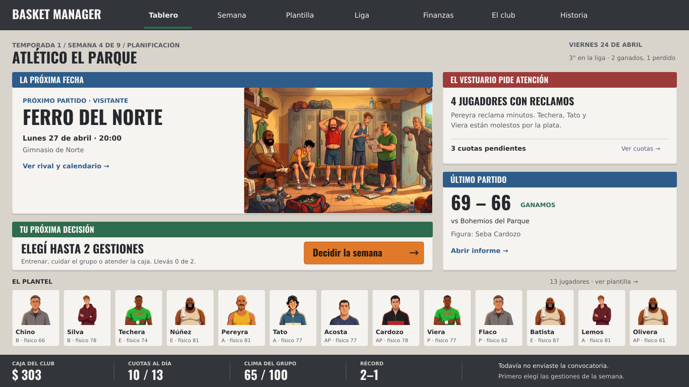
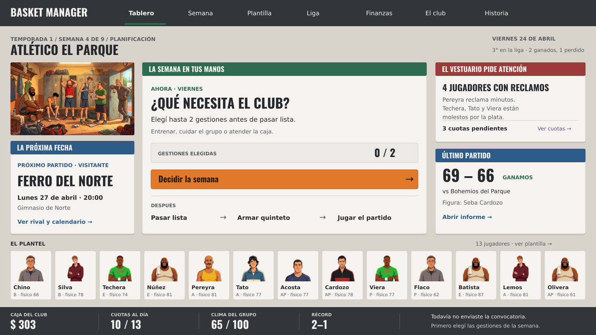

# Dos propuestas de tablero — 15 de septiembre de 2026

**Decisión de Gabi: A elegida como base del tablero (2026-09-15), integrada en `src/ui/Hub.tsx`.** Resolución: 1366 × 768. No son capturas de una versión implementada ni prototipos navegables.

## A · La próxima fecha — elegida

El rival y el encuentro ocupan el primer plano. La escena del vestuario acompaña el próximo partido. La decisión semanal queda en una franja propia, inmediatamente debajo. Favorece la anticipación deportiva y la presencia del club.

## B · La semana en tus manos — alternativa archivada

La tarea actual queda en el centro, con el presupuesto de dos gestiones y la secuencia que sigue. Rival, vestuario e informe acompañan. Favorece la comprensión del ciclo para alguien que juega por primera vez.

## Comparación controlada

Las dos usan **el mismo estado de prueba** (`estado.json`), obtenido mediante tres fechas del motor con semilla 11 y quinteto sugerido: semana 4, récord 2–1, caja $303, 13 jugadores y último resultado 69–66. No es una reconstrucción de la partida del usuario. La escena y los ocho retratos son los assets aprobados de `public/arte`; se conserva deliberadamente su repetición. Oswald es la fuente empaquetada del juego. Ningún asset nuevo fue generado.

## Decisión y criterio de diseño

Gabi eligió A: «el partido tiene que ser central […] el stress de manejar un equipo es justamente llegar bien al partido». Confirmó: «perfecto. tomemos A y documento la decision en el repo».

**El partido ordena la semana. La gestión prepara al equipo para llegar bien al próximo encuentro.** A reemplaza la recomendación inicial de B, que priorizaba explicar las tareas semanales. Se conserva B como referencia de la exploración, sin combinar ambas como nueva dirección aprobada.

Criterios acordados para desarrollar A:

- Rival, día, horario y cancha como foco principal del tablero.
- La pregunta «¿Cómo llegamos?» organiza disponibilidad, estado físico y problemas del vestuario relevantes para el encuentro. Distinguir siempre disponible de confirmado.
- Cambiar «Tu próxima decisión» por «Preparar el partido»: entrenar, hacer un asado, cobrar cuotas y convocar son decisiones con consecuencias deportivas y sociales, algunas de varias semanas.
- El informe cierra el recorrido: qué pasó con el equipo preparado y qué consecuencias deja para la próxima fecha.

La elección aprueba A como base de composición y estos criterios de desarrollo. Las láminas conservan el boceto original; los ajustes de texto y la implementación React se incorporaron en la siguiente tanda autorizada. Se mantienen la paleta, Oswald y el arte aprobado; la producción de personajes y escenas sigue su proceso en `design/ART_PIPELINE.md`.

## Archivos

- `tablero-a.png`, `tablero-b.png`: imágenes listas para comparar.
- `tablero-a.svg`, `tablero-b.svg`: láminas vectoriales autónomas; las imágenes están embebidas y los titulares usan curvas de Oswald.
- `estado.json`: datos compartidos de la comparación.
- `generar.py`: fuente de las dos composiciones. Requiere Python con fontTools y Node con sharp (o `CODEX_PRIMARY_RUNTIME_NODE_MODULES` apuntando a la instalación). Ejecutar `python3 design/propuestas/generar.py` desde la raíz, después de `npm ci`. Para PNG, rasterizar los SVG con sharp.

Verificación realizada: ambas láminas fueron rasterizadas e inspeccionadas a 1366 × 768. La implementación React se verifica con build y tests; la inspección interactiva se realiza en el sitio publicado porque el navegador de esta sesión bloqueó localhost y los archivos locales.
