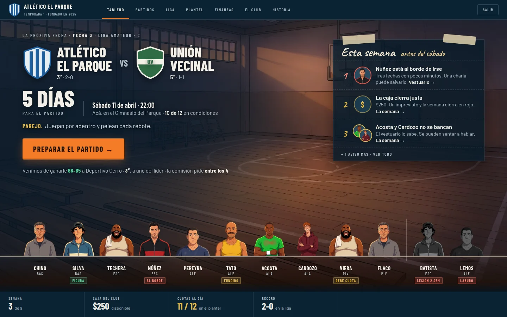
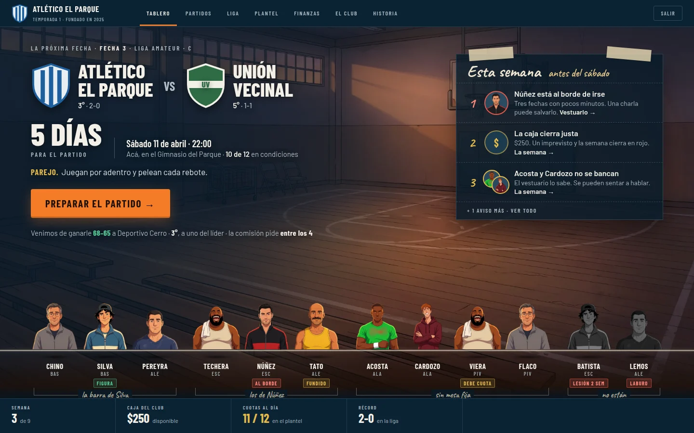
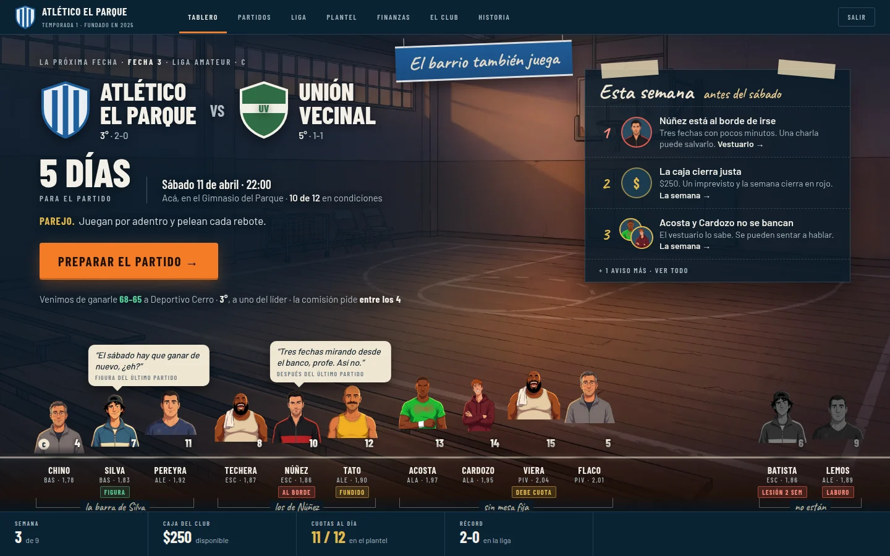
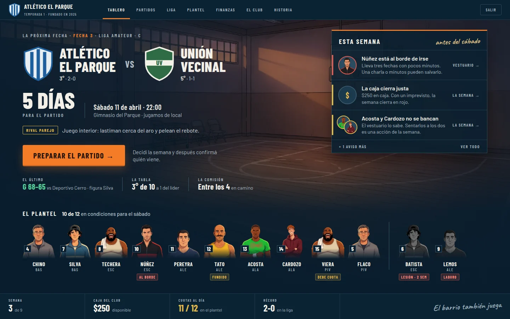

# Tablero — rediseño desde cero (propuesta, 28 de septiembre de 2026)

**Estado:** Gabi aprobó la estructura como dirección (28/9). La segunda pasada, sobre identidad
y dirección de arte, está abajo y espera su visto bueno. **Todavía no hay nada implementado en
el juego.**

## Cuarta pasada — sin los grupos del vestuario (v4, la vigente)

Decisión de Gabi (28/9): **el Tablero no muestra quién pertenece a cada banda.**
- Eso lo descubre el jugador cuando entra al Vestuario, no en el menú principal.
- Los grupos son dinámicos, y las dinámicas de grupo van a cambiar durante el juego. Fijarlos
  en la pantalla de inicio iba a dar problemas.

Cambios respecto de la v3:
- **Sin llaves ni nombres de grupo.** El plantel disponible va en una sola fila, **ordenada por
  puesto** (BAS → PIV), repartida a todo el ancho.
- **Los que no están** van al final, separados por una línea vertical fina y en gris.
- En la implementación **no se usa `buildSocialMap`** en el Tablero.

Lo que sí sigue en el Tablero es un **roce que ya es un problema para resolver** (un aviso de
`watchItems`, como «Acosta y Cardozo no se bancan» en «Esta semana»). Es una tarea de la
semana, no una foto de quién anda con quién.

Archivos: `v4-1440.webp`, `v4-1366.webp`, `maqueta-v4.html`.

---

## Tercera pasada — correcciones de Gabi sobre la v2 (v3)

Gabi marcó cuatro cosas de la v2: «está muy cargado», los globos tapan a los jugadores, el
cartel sobra y los jugadores quedaron desalineados y apretados hacia la izquierda.

- **Sin globos.** Los jugadores se ven enteros. Lo que dijeron en el vestuario queda para el
  hover o para el Vestuario.
- **Sin el cartel** «El barrio también juega».
- **Alineados.** Todos los bustos tienen el mismo tamaño y apoyan sobre la misma línea del
  parquet. Se saca la altura variable (punto 7 de la v2), que se leía como desalineación, y
  con ella la altura escrita debajo del nombre.
- **A todo el ancho.** Los cuatro grupos se reparten entre los márgenes de la pantalla y los
  bustos crecen (100 px a 1440, 90 px a 1366).
- **Menos carga.** Se sacan el número de camiseta y la C de capitán, que además no existen en
  los datos (punto 10 de la v2).

Sigue todo lo demás de la v2:
- el gimnasio visible y la luz de las ventanas;
- «Esta semana» como planilla con cinta;
- la información secundaria en frases;
- los grupos del vestuario debajo de la fila;
- «Figura» y los estados escritos.

Archivos: `v3-1440.webp`, `v3-1366.webp`, `maqueta-v3.html`.

---

## Segunda pasada — identidad y dirección de arte (v2)

Gabi dejó una consigna para esta pasada:
- Misma composición y misma jerarquía: próximo partido, preparar el partido, problemas de la
  semana y plantel.
- Más mundo de básquet amateur y menos dashboard.
- El gimnasio integrado con la interfaz.
- La información secundaria más simple.
- Más vida en la fila del plantel.
- Nada de restyling ni de cambiar colores por cambiarlos.

Los cambios concretos:

### El gimnasio deja de ser un fondo
1. **Menos velo.** En la v1 una cortina oscura tapaba dos tercios de la escena. Ahora el
   oscurecimiento es **local**: una sombra detrás del texto del hero. El centro, las ventanas y
   el piso se ven.
2. **La luz de las ventanas cruza la pantalla.** Un haz cálido cae sobre «Esta semana» y sobre el
   piso. Es la regla «UI fría + mundo cálido» (Art Bible §5) aplicada a la UI y no sólo a la
   ilustración.
3. **El plantel está parado en la cancha.** La base de la fila es la **línea lateral pintada del
   parquet**, cada jugador tiene su sombra en el piso y los que no están quedan aparte, en gris.
4. **La frase del club pasa al mundo.** «El barrio también juega» deja la firma del HUD y es un
   **cartel colgado** en la pared del gimnasio. En la maqueta está hecho con CSS. En producción
   debería venir pintado en el arte de la escena, y la UI no lo dibuja.

### Menos dashboard
5. **«Esta semana» es una planilla pegada con cinta.** Título manuscrito, números 1-2-3
   manuscritos y coloreados según la gravedad (reemplazan la barra lateral de color),
   separadores punteados y sin filete naranja. El destino queda dentro de la frase
   («… Vestuario →») en vez de ser una columna de links.
6. **La información secundaria son frases, no indicadores.**

   | Hoy (v1) | v2 |
   |---|---|
   | Tira de tres indicadores (último, tabla, comisión) | Una línea en la voz del club: «Venimos de ganarle 68–65 a Deportivo Cerro · 3°, a uno del líder · la comisión pide entre los 4» |
   | Chip «RIVAL PAREJO» | «**Parejo.** Juegan por adentro y pelean cada rebote.» |
   | «10 de 12 en condiciones», como título del plantel | Junto a la fecha y la cancha, que es donde importa |
   | Título «El plantel» | Se va: la fila se entiende sola |
   | «Jugamos de local» | «Acá, en el Gimnasio del Parque» |

### El plantel con vida
7. **La altura real.** Cada busto se recorta según la altura del jugador (`height`, en cm), así
   que los pívots asoman por encima de los bases. La fila deja de ser una grilla de fotos
   iguales y pasa a ser un grupo de gente. Debajo del nombre va la altura (1,78 · 2,04).
8. **Parados con su grupo.** Los jugadores se agrupan según su mesa del vestuario
   (`buildSocialMap`: grupos y sueltos), con una llave y el nombre del grupo en manuscrita
   debajo («la barra de Silva», «los de Núñez», «sin mesa fija»). El Tablero muestra el mapa
   social que hoy sólo aparece en el Vestuario.
9. **Globos con lo que dijeron.** Como mucho dos frases de lo que dijo alguien en el vestuario
   después del último partido. Salen de `lastMatch.moods`, que ya tiene voces por arquetipo.
   Una es de un problema y la otra buena (la figura), para que la fila no sea sólo alarmas.
10. **Marcas de rol.** «Figura» del último partido (`mvpName`, ya existe). La **C de capitán y el
    número de camiseta hoy no existen en los datos**: o se agregan (dato nuevo, con su
    migración de save) o se sacan de la implementación.
11. **Hover (no se ve en la captura).** El jugador da un paso adelante: sube unos píxeles, se
    aclara y muestra su estado en una línea.

### Lo que esta pasada no cambia
La composición, la jerarquía, los tamaños del hero, el CTA, los colores, el nav y el HUD.

### Riesgos y decisiones
- **La voz manuscrita llega al límite.** Ahora está en tres lugares: el cartel, la planilla y
  los grupos. La Art Bible pide moderación. Si hay que sacar uno, sugiero que sea la llave de los
  grupos.
- **Las caras repetidas se notan más.** Con la fila más protagonista, Techera y Viera son la
  misma cara. Esto empuja todavía más a hacer los retratos por capas (T5).
- **El cartel y la línea del parquet piden arte propio.** Con `fondo-gimnasio` espejado la
  línea no coincide con la perspectiva del piso. El brief de `bg-tablero-v01` tendría que
  pedir el piso en plano bajo y una pared libre para el cartel. Eso se inclina por la opción
  (b), el gimnasio, en vez de la sede.
- **Datos:** todo sale del estado actual salvo el capitán y el número de camiseta (punto 10).

Archivos: `v2-1440.webp`, `v2-1366.webp`, `maqueta-v2.html`.

---

## Primera pasada — estructura (v1, aprobada como dirección)
Es una maqueta estática (`maqueta.html`) con datos inventados, capturada a 1440×900 y
1366×768. La escena es `fondo-gimnasio.webp` espejado, como sustituto del arte que el Tablero
todavía no tiene (`bg-tablero-v01`, P1 en `design/arte/ASSET_REGISTRY.md`).

Hoy: `design/capturas/2026-09-25-componentes/1440-tablero.webp`.

## Qué le pasa al Tablero actual

Los componentes están bien. El problema es de **composición**:

- **Son seis cajas.** El partido, «¿Cómo llegamos?», el último partido, el plantel, los atajos
  y el HUD tienen el mismo peso visual. El ojo no sabe dónde empezar. Es lo que la Art Bible
  llama «pantallas hechas sólo de cards» (§17).
- **El mundo está en una caja.** La ilustración vive encerrada dentro de la card del partido.
  Además es la del Vestuario, repetida, y es anterior a la Art Bible. La UI no está «integrada
  al mundo», está puesta al lado de una foto.
- **La información importante no se destaca.** «¿Cómo llegamos?» son tres números sin cara
  (12 · 0 · 0). Los avisos aparecen como texto dentro de esa card. Las personas son 12
  miniaturas iguales con tres puntitos de colores que hay que decodificar con una leyenda.
- **La mitad del espacio es relleno.** Por ejemplo: «Lo que dejó el último partido» ocupa un
  cuarto de la pantalla para decir que todavía no hay partido. Los siete atajos repiten la
  navegación.
- **No se lee como juego.** Paneles gris perla, títulos de sección y links subrayados: es la
  gramática de un panel de administración.

## La idea

**Lunes en el club. Faltan cinco días para el partido: ¿llegamos bien?**

La decisión del 15/9 (propuesta A: «el partido ordena la semana») se mantiene. Esta
propuesta la lleva hasta el final. La pantalla se organiza en tres capas de lectura, en este
orden:

1. **El partido** (qué viene): el protagonista, grande, sin caja.
2. **Lo que hay que resolver** (qué hago): pocas cosas, con cara y con destino.
3. **Las personas** (con quién): el plantel de pie, con el problema escrito debajo de cada uno.

Todo lo demás (el último resultado, la tabla, la comisión) pasa a ser contexto de una línea.

## Qué cambia y por qué

| Elemento | Hoy | Propuesta | Por qué |
|---|---|---|---|
| **Escena** | Ilustración del vestuario dentro de una card | **Escena a pantalla completa** (SCENE-C) detrás de todo, con velos que oscurecen donde va texto y dejan ver la luz del gimnasio en el centro | La UI flota sobre el mundo en vez de estar al lado de una foto. Es lo que hace la lámina 05 en cada cuadro |
| **Próximo partido** | Card con escudo del rival de 64 px y el nombre en 30 px | **Hero sin caja**: los dos escudos a ~90 px, nombres en display de 40 px, posición y récord de cada uno. Debajo, la cuenta regresiva **«5 días»** como dato gigante, más fecha, cancha y la clave del rival | Es lo más importante de la pantalla y tiene que parecerlo. La cuenta regresiva convierte la semana en tensión: es el reloj del juego |
| **CTA** | Botón dentro de una franja de la card | **Un solo botón naranja grande**, en el hero, pegado a la información del partido | Un CTA por pantalla (Art Bible §7). Está donde termina la lectura del partido |
| **¿Cómo llegamos? + avisos** | Tres números + avisos en texto | **«Esta semana»**: la única superficie con panel. Hasta 3 problemas, cada uno con **la cara de quien lo tiene** (o un ícono si es la caja), una línea que explica y a dónde ir a resolverlo. El resto queda en «+N avisos más». Subtítulo manuscrito: «antes del sábado» | Los avisos (`watchItems`) *son* las decisiones de la semana. Una cara se lee antes que una frase, y el destino evita tener que pensar a dónde ir |
| **Disponibilidad** | «12 disponibles · 0 de baja · 0 fundidos» | **«10 de 12 en condiciones para el sábado»**, como título del plantel | Un solo número, con contexto. El detalle está en las caras de abajo |
| **Plantel** | 12 miniaturas en marco, con 3 puntos de color y una leyenda | **Los jugadores de pie** (busto M, sin marco, con número de camiseta), apoyados sobre el piso de la escena. El que tiene algo lleva **la palabra** debajo («Al borde», «Fundido», «Debe cuota»). Los que no están van separados y en gris | Las personas son la fantasía del juego (Art Bible §1). Las palabras reemplazan un código de colores que había que aprender |
| **Último partido** | Card de un cuarto de pantalla | **Una línea** en la tira de contexto: «G 68–65 vs Deportivo Cerro · figura Silva» | Es contexto, no la tarea de hoy. El informe completo sigue en Partidos → Informe |
| **Tabla y comisión** | Sólo en los atajos | En la misma tira: «3° de 10 · a 1 del líder» · «Comisión: entre los 4 · en camino» | Son la otra presión de la semana. Ocupan una línea y no una pantalla aparte |
| **Atajos** (Cuerpo técnico, Tabla, Rankings…) | Fila de 7 botones | **Se van** | Repiten la navegación de arriba. Los que importan hoy aparecen en «Esta semana» o en la tira |
| **Título de pantalla** | «EL TABLERO DEL CLUB / Atlético El Parque» | **Se va**: el nav ya dice Tablero y el club está en la esquina | Libera arriba para el partido |
| **Voz manuscrita** | No existe | En **dos lugares**: «antes del sábado» y la firma del HUD («El barrio también juega») | Tercera voz de la Art Bible (§6): rompe la sensación de software, usada con moderación |
| **Nav y HUD** | — | Sin cambios | Son el shell global. Esto es sólo el Tablero |

### Según la fase de la semana

La misma composición cambia lo que muestra el hero, sin mover nada de lugar:

- **Semana / convocatoria / quinteto:** como en la maqueta. El CTA sigue la fase («Resolver la
  convocatoria», «Armar el quinteto»).
- **Partido en curso:** los escudos rodean el **marcador en vivo** y el CTA es «Volver a la
  cancha».
- **Después del partido:** el hero muestra el **resultado final** grande con la figura, y la
  cuenta regresiva pasa a ser la del próximo rival.
- **Primera fecha de la temporada:** la tira de contexto dice lo de la temporada pasada, o
  «La historia empieza en la cancha».
- **Semana sin problemas:** «Esta semana» se achica a una nota manuscrita («Semana
  tranquila. Buen momento para un asado») y la escena gana espacio.

## Lo que la maqueta no resuelve (hay que decidirlo)

1. **El arte de la escena.** El gimnasio vacío sirve para probar la composición, pero el
   Tablero pide su propio fondo. Hay dos opciones:
   - (a) la **sede o comisión con ventana a la cancha**, que es la ficha `bg-tablero-v01`;
   - (b) el **gimnasio propio a la tarde**, que ya existe. Es menos específico, pero conecta el
     Tablero con «el partido es el centro».

   La composición pide la zona izquierda y la franja de abajo tranquilas, con la luz en el
   centro-derecha.
2. **Las caras repetidas.** Con bustos más grandes se nota más que hay 8 caras para 12
   jugadores (en la maqueta, Techera y Viera son el mismo). Esta composición pone a las personas
   en primer plano, así que **empuja a T5** (retratos por capas). Mientras tanto se puede bajar
   el busto a tamaño S sin perder la composición.
3. **Panel oscuro sobre la escena.** «Esta semana» usa el panel azul noche translúcido, como el
   Vestuario (la excepción de §22 para escenas), no el gris perla. La pantalla queda más oscura
   que la actual. La luz tiene que venir del arte, no de los paneles. Si Gabi la encuentra
   oscura, esto se decide con el arte definitivo delante.
4. **Fuente manuscrita.** La maqueta usa Caveat. Sumarla es una dependencia más (Fontsource,
   ~20 kB) y es decisión de Gabi. Hay otras candidatas si ésta no convence.
5. **Láminas maestras.** En el repo sólo está la lámina 05. Las láminas 1 («Inicio y Club») y 2
   («La Semana») seguramente dicen algo del Tablero. Si Gabi las sube a
   `design/arte/referencias/`, se contrasta la propuesta contra ellas.

## Si se aprueba, qué se toca

`src/ui/Hub.tsx` y `src/ui/Hub.css`, más la fuente manuscrita si va. **Sin cambios de lógica
ni de datos.** Todo lo que muestra la maqueta ya existe en el estado:

| Qué muestra | De dónde sale |
|---|---|
| Avisos | `watchItems` |
| Disponibilidad | `hubReadiness` |
| Estado de cada jugador | `playerSignals` |
| Tabla | `standings` |
| Comisión | `objectives` |
| Último partido | `lastMatch` |
| Fecha y cancha | `userFixtureOfWeek` |

Se verifica a 1440×900 y 1366×768 en las fases de la semana. Las demás pantallas no se tocan
hasta que el Tablero esté aprobado en el juego real (Art Bible §20: «funciona en el juego real,
no sólo como mockup»).

## Archivos

| Archivo | Qué es |
|---|---|
| `propuesta-1440.webp`, `propuesta-1366.webp` | Capturas de la maqueta |
| `maqueta.html` | La maqueta. Toma el arte de `public/arte/` y las fuentes de `node_modules/` (después de `npm ci`). Caveat no está instalada, así que sin ella la voz manuscrita cae a la cursiva del sistema |
